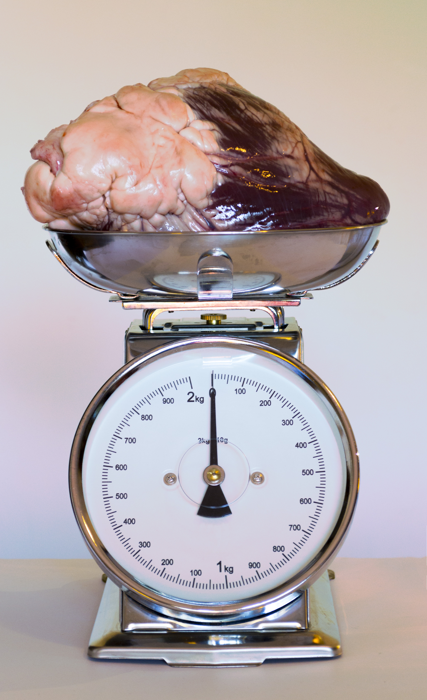

```grid|1
 
```

E se i nostri sentimenti potessero essere quantificati? La facilità e l’accessibilità
con le quali iniziamo nuove relazioni, costruiamo nuovi rapporti
e generiamo maniere sempre più immediate e dirette per entrare brevemente
in contatto con qualcuno, ci sta abituando a nutrire sentimenti
sempre più effimeri? Fugaci? Leggeri? Senza peso.