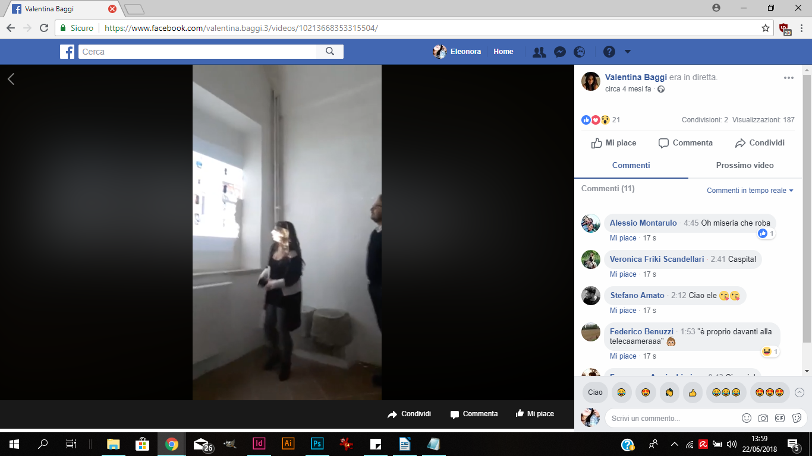
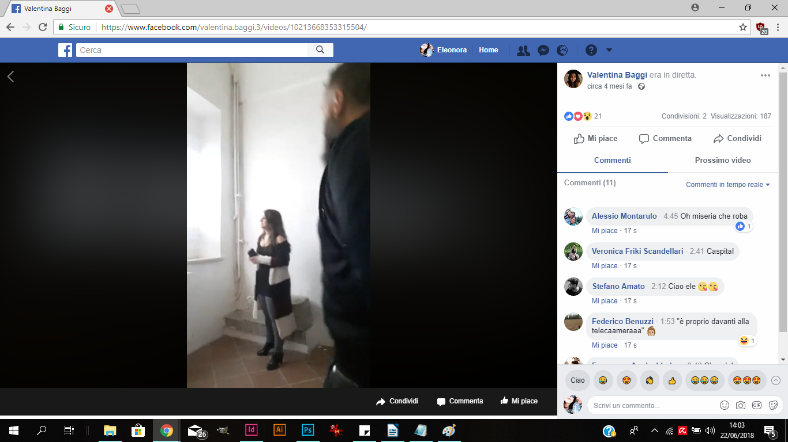
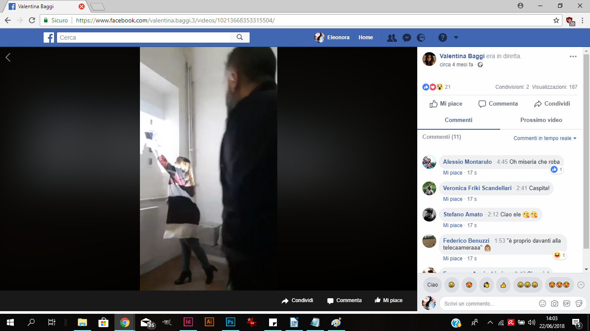
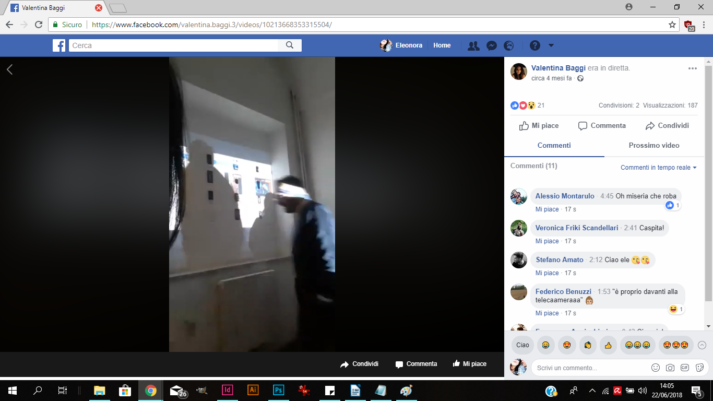
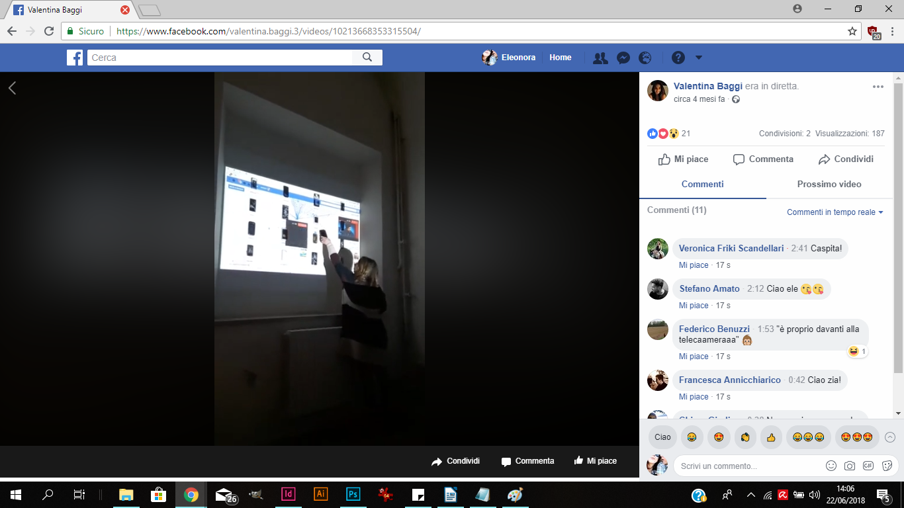

```grid|2|Genovese Images


```

Installazione | Installation
Esigenze di installazione variabili | Variable installation requirements
16 distrutti | destroyed


```grid|2


```

```grid|3



```

Il caso Genovese è un episodio di cronaca del 1964 riguardante l’omicidio di una giovane ragazza, Kitty Genovese. Venne ripetutamente accoltellata nel cortile del proprio isolato, a New York, senza che nessun vicino intervenisse. Le circostanze del suo assassinio e la mancata reazione da parte dei suoi vicini, divennero il simbolo di un fenomeno psicologico noto come effetto spettatore o sindrome Genovese.
In qualche modo, anche oggi assistiamo al medesimo fenomeno.

```grid|2


```

La mappa di Facebook Live (o Facebook Live Map) è un portale creato dal social network di Mark Zuckerberg che permette di accedere a una mappa interattiva che mostra tutte le dirette pubbliche in svolgimento nel mondo su Facebook, tramite la sua applicazione di live streaming. <br />Nato per competere sopratutto con Youtube, pare che in realtà la diretta social sia diventato uno strumento di spettacolarizzazione per atti di violenza subiti o autoimposti.

```grid|1


```

I sedici smarthphone distrutti rappresentano sedici persone (ogni smarthphone è assocciato ad una vittima, ed è stato danneggiato nello stesso modo in cui è deceduta la persona che rappresenta) hanno perso la vita in diretta mentre questo video veniva visualizzato, non solo da amici o parenti, ma anche da chi era connesso a Facebook Live Map. Tuttavia non c’è stata nessuna reazione, nessun tentativo di salvataggio o di avvisare le autorità, sebbene stessero sempre guardando in molti.

```grid|1

```

La mappa di Facebook Live è stata, come per la Genovese, un cortile di vicini silenziosi ma curiosi che sentivano, vedevano ma che decisero di rimanere spettatori impassibili.
Gli smartphones distrutti sono attaccati ad una parete sulla quale viene proiettata la mappa di Facebook Live in diretta. Quando il cursore tocca un disco luminoso azzurro, ci fa visualizzare un video in diretta che può essere a Bangkok come a Washington D.C.

```grid|1

```

Contemporaneamente, il fruitore è esso stesso in diretta (quindi rappresentato da un disco luminoso azzurro sulla mappa nel luogo in cui si trova) perché viene filmato, a sua volta, dall’unico smartphone funzionante dell’intera installazione ambientale. Creando un gioco di specchi infinito.
