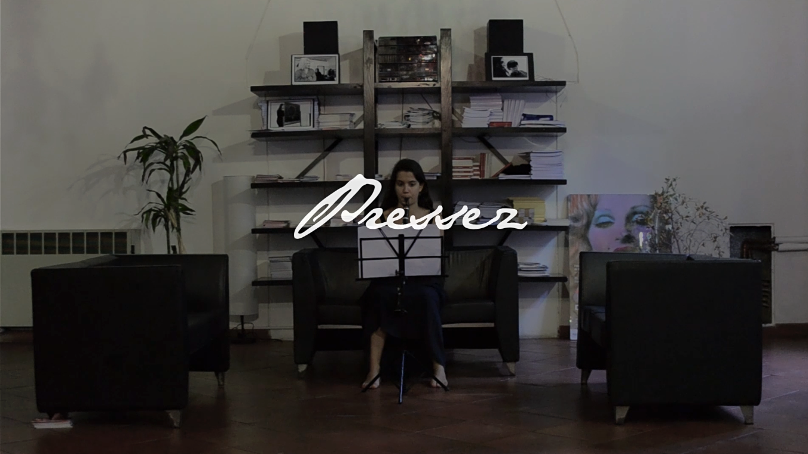
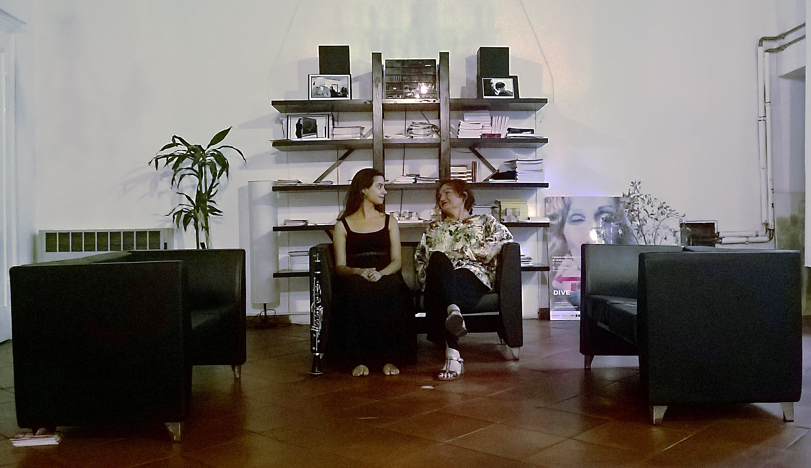
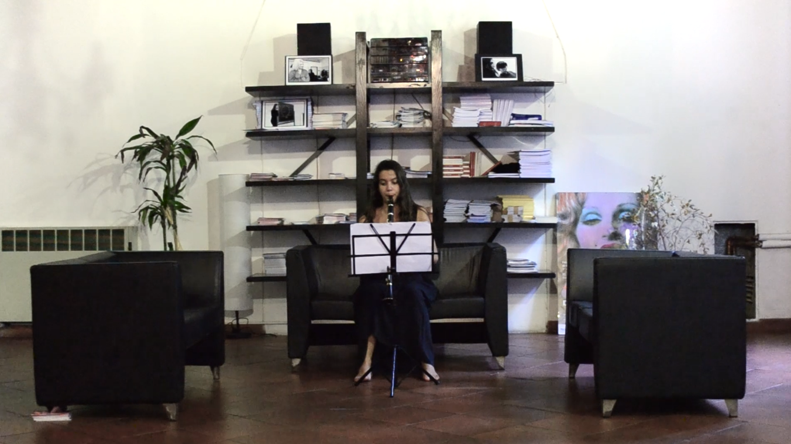

<iframe src="https://player.vimeo.com/video/233209806" width="640" height="360" frameborder="0" allow="autoplay; fullscreen" allowfullscreen></iframe>

 

#Se voglio un titolo lo scrivo

Video | Video
Durata 00:06:46 minuti | 00:06:46 minute

Olivier Massien fu rinchiuso in un campo di prigionia durante la Seconda Guerra Mondiale e fu lì che compose i suoi lavori di maggior rilievo.
La musica di Massien dona pace, anche quando la pace, per qualsiasi motivo, non fa parte del proprio mondo.
Questo componimento rappresenta la via di fuga per un uomo che è stato costretto in un luogo che non gli apparteneva, una forzatura, che tuttavia non è riuscita ad indebolire la forza creatrice e lo spirito che albergavano dentro di lui.
Nei video art la location è fondamentale, scegliere la sede del MIT [Movimento Identità Transessuale] non è stato un caso.

Doveva essere un luogo che rappresentasse coloro che, in qualche modo, considerano il proprio sé confinato in uno spazio che non gli appartiene o che gli risulta forzato, ma che trovano ugualmente la possibilità di sprigionare il proprio essere. Un luogo di nuova possibilità, di rinascita. Laddove il sé può esprimersi in uno spazio coerente con la propria natura, la spinta creativa può dilatarsi armonicamente nel fuori da sé; ciò tuttavia non significa che se ne avverta la necessità o l’urgenza.
Una costrizione di qualsivoglia natura può, invece, forzare la necessità e l’urgenza di esplorare le profondità del proprio sé, per trovare una via alternativa per dargli voce, generando, talvolta, inaspettate meraviglie.

Pressez, l’imperativo del francese presser ovvero pressare o stringere, è un’indicazione di interpretazione che Massien appunta nella partitura del suo brano Abîme des Oiseaux per indicare un’accelerazione del movimento. Il termine indica quindi la costrizione ma evoca anche, nella sfumatura che cogliamo dalla scrittura musicale, la forza incalzante che spinge verso la liberazione.
Associazione Onlus, fondata nel 1982 a Bologna, che difende e sostiene i diritti delle persone transessuali, travestiti, transgender e genderqueer.
Nota al grande pubblico per la trasmissione #ViteDivergenti – Storie di un Altro Genere, un progetto realizzato in collaborazione con RealTime.

