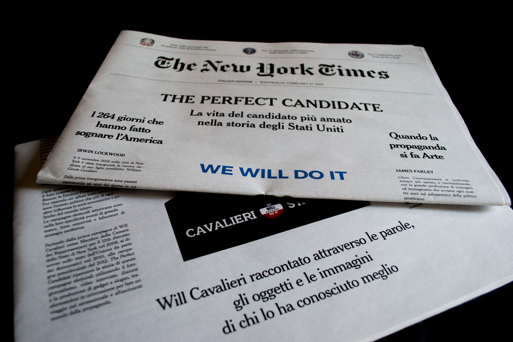
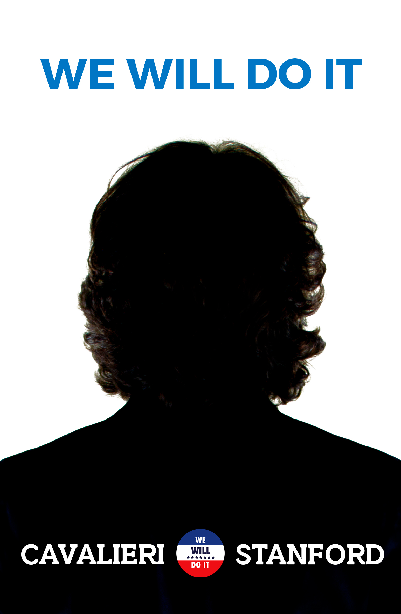
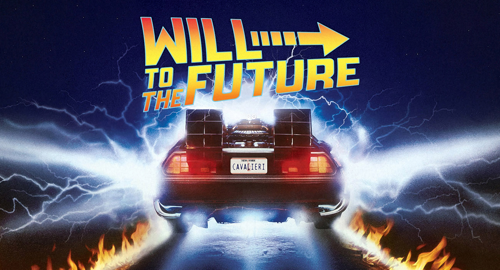
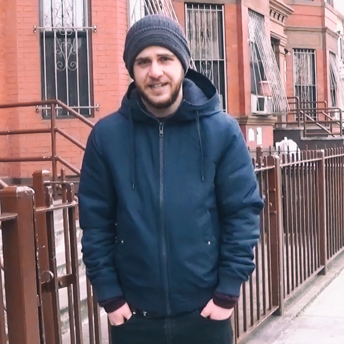
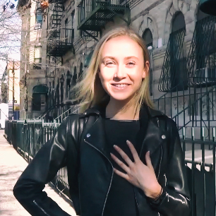
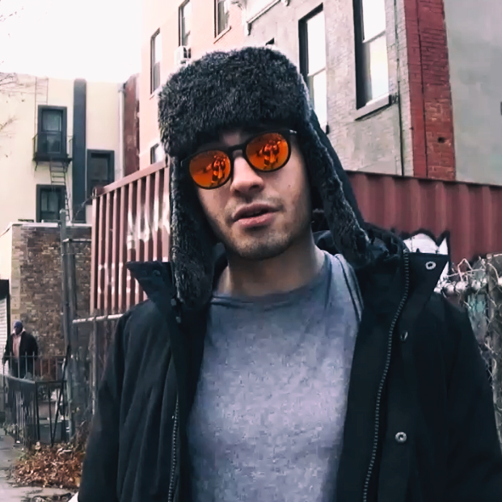
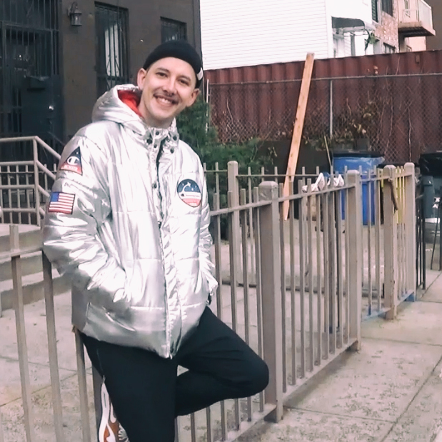
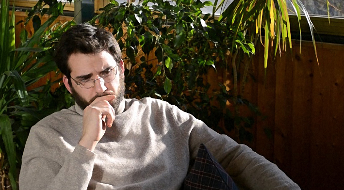
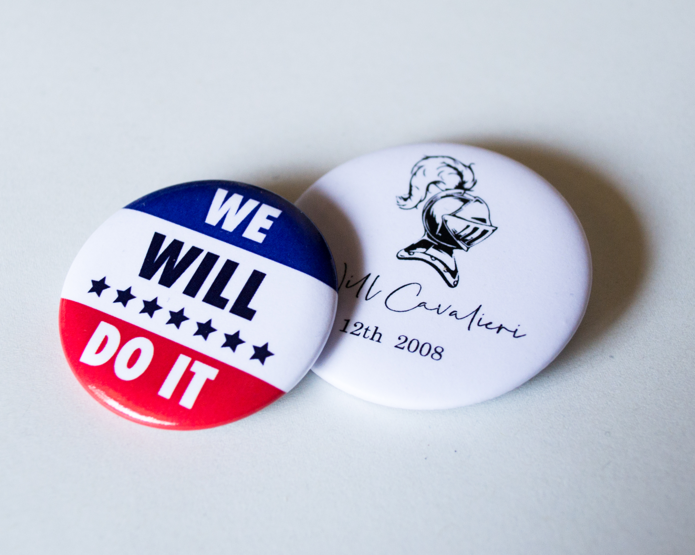

La mostra THE PERFECT CANDIDATE inaugura la prima volta al Brooklyn Museum di New York il 6 novembre 2018, esattamente sei anni dal giorno in cui Will Cavalieri sarebbe dovuto diventare Presidente degli Stati Uniti d’America.
La mostra THE PERFECT CANDIDATE è, infatti, una retrospettiva dedicata ai momenti più salienti della vita del candidato democratico per la Casa Bianca.
Le origini, la famiglia, la storia, le campagne elettorali, gli scandali, i successi e il triste epilogo di uno dei personaggi più discussi del XXI secolo.
La prima fermata europea per la mostra non poteva che essere l’Italia, terra d’origine di Cavalieri, dopo le tappe di Washignton D.C. e San Francisco.



Ogni quattro anni il mondo segue con il fiato sospeso la lunga corsa alla Casa Bianca: le Elezioni Presidenziali. Pur essendo un affare tutto americano, sono l’evento politico che più di ogni altro influenza le sorti economiche e politiche del mondo intero. Le campagne elettorali americane sono nella loro specificità eventi di grande teatro, forte emotività e laboratori di strategia mediatica.
Partendo dalla prima campagna di Will Cavalieri come Membro della Camera dei Rappresentanti per il 12th distretto dello Stato di New York nel 2008, al discorso di risposta sullo stato dell’Unione da parte dei democratici nel 2010, alla campagna presidenziale del 2012. The THE PERFECT CANDIDATE ripercorre la storia di queste campagne elettorali utilizzando il fotogiornalismo, video interviste, discorsi e la produzione di gadget e slogan, trasformandosi in un’occasione per fare un viaggio nel sensazionale e affascinante mondo della propaganda.

 Il Manifesto creato dall’artista emergente Viva Burgbage durante le primarie democratiche del 2012. Diventa un simbolo per tutta la duranta della campagna elettorale di Will Cavalieri.

**Intervista alla dottoressa Arianna Farinelli**
>“Will Cavalieri era sicuramente l’impersonificazione di una necessita che in qualche modo l’America, specialmente quella America giovane e cosmopolita che aveva iniziato a votare, voleva che si manifestasse.
Cavalieri era giovane, sarebbe stato il Presidente più giovane degli Stati Uniti avessero mai avuto, di bell’aspetto-anche se un po’ basso, caratteristica mai trascurata dai suoi avversari- carismatico, caparbio e molto coraggioso nelle scelte -come l’essere uno dei pochi candidati ad aver scelto una donna come Vicepresidente-, spesso volutamente provocatorio, proiettato già verso un futuro che diceva inarrestabile, che prescindeva da lui e che -prima o poi- si sarebbe concretizzato -non dimentichiamo il famoso gioco di parole del suo slogan We Will Do It-, non poteva non diventare un vero e proprio fenomeno.
New York lo amò subito, fin dalla sua prima campagna, nel 2008. Cavalieri riusciva a trasmettere la sensazione che tutto sarebbe stato possibile e New York aveva bisogno di un paladino che difendesse per tutto il Paese quei valori di uguaglianza e giustizia sociale tanto cari alla sua città natale.
Sembrava non avesse paura di nulla, uno dei suoi discorsi più famosi rimane quello a favore del controllo sulle armi. Decise di assumere una posizione molto radicale sull’argomento, mettendosi contro tutta la lobby delle armi o, comunque, molti possibili elettori.
Questo, come altri temi scottanti -ad esempio l’istruzione e la sanità pubblica-, fanno pensare che non si abbia, ancora oggi, la certezza che avrebbe vinto nel 2012 ciononostante sappiamo con certezza che uno dei suoi più grandi talenti era quello di essere un abile trascinatore. Il suo pensiero era troppo radicale per trovare una via d’incontro con chi la pensasse in maniera diametralmente opposta alla sua, ma aveva la capacità nello spostare dalla sua parte gli indecisi, quella parte di elettorato che può cambiare schieramento politico ad ogni elezione o quella fetta di elettori non abituata a votare. Sicuramente lo ha premiato la sua scaltrezza suoi social media, è il primo ad averli usati bene e con successo, avvicinandosi anche a quegli elettori che sono più abituati a leggere un post su facebook o un twitter piuttosto che un articolo su un vero giornale.
Ironizzava molto quando veniva attaccato sul personale, tutti si ricordano la risposta che diede all’ex Presidente -durante il loro primo dibattito televisivo- quando quest’ultimo parlò del bisnonno di Cavalieri, Saverio Cavalieri, che immigrò dall’Italia agli inizi ‘900 per sfuggire dalle ripercussioni giuridiche di un delitto d’onore che aveva commesso oppure quando, durante la campagna, molti giornalisti filo-repubblicani insinuarono fosse omosessuale perché non era sposato e aveva posizioni molto precise in merito ai diritti delle famiglie arcobaleno.
Era per questi motivi che i suoi sondaggi erano molti buoni, di certo era il candidato democratico perfetto. Ci chiederemo per sempre se sarebbe stato anche il Presidente perfetto.


```grid|1

```

>Io l’ho incontrato solo una volta, era un evento per la sua campagna durante le primarie democratiche, qui a New York, incentrato sull’importanza dell’istruzione pubblica. Fece un discorso di tre ore consecutive e mi ricordo che ad un certo punto aveva sforato di molto il tempo che aveva a disposizione per quell’evento,ma nessuno abbandonò il suo posto a sedere -per chi lo avesse trovato-, eravamo tutti incantati dal suo modo di parlare, dalla sua gestualità e da quello che diceva.
Nel 2012 le idee conservatrici cominciavano a dilagarsi sempre di più, ma Will Cavalieri faceva credere a tutti che questo tipo di politica non poteva sopravvivere a coloro che l’avevano inventata e che l’America era pronta per quel futuro ottimista del quale Cavalieri si faceva, certe volte forse in maniera fin troppo semplicistica ma sempre convincente, il suo portavoce.
Non dimenticherò mai il giorno in cui sentii la notizia, era una domenica di novembre, un po’ nuvolosa e io stavo guardando mio figlio giocare a calcio. Sentii un grande dolore collettivo, quasi -definirei- globale dritto al petto. Il tempo si era fermato. Per tutte le ore che non si seppe con esattezza se era vivo o morto, non c’erano rumori provenire dalla strada, non c’erano sirene o schiamazzi, nessuno stereo e per una città come New York sembrava qualcosa di impossibile. Eravamo tutti in attesa, tutti in pausa ad aspettare quello che in realtà sapevamo già. Tutti avevamo la tv accesa e vedevamo ininterrottamente le stesse immagini che non facevano altro che ripetersi; da quell’incidente non si sarebbe potuto salvare nessuno. Neppure Cavalieri.”_

```grid|4| Alcuni fotogrammi dal documentario The Demillennials, 2012 di Ian Lee




```

```grid|2
 Frammento 00:16:32, dal film-intervista November Leaves di Leo Gardiner, 2018
 Un bottone bianco con l’elmo di un cavaliere e la firma del del candidato newyorkese è la trovata per la campagna del 2008 come membro dei Rappresentati alla Camera per il 12th distretto per lo Stato di New York. We Will Do it. Il leit motive della corsa alla Presidenza 2012 di Cavalieri. Con sfondo i colori della bandiera americana.
```


